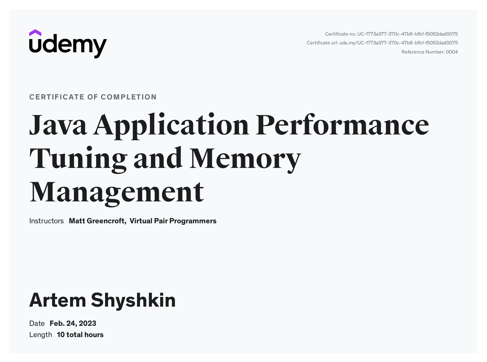

![Project licence][licence]

# art-matt-java-performance
Tutorial - Java Application Performance and Memory Management - from Matt Greencroft (Udemy)

- Section 1: Chapter 1 - Introduction
- [Section 2: Chapter 2 - Just In Time Compilation and the Code Cache](performance-example-01/README.md)
- [Section 3: Chapter 3 - Selecting the JVM](performance-example-01/README.md#section-3-chapter-3---selecting-the-jvm)
- Section 4: Chapter 4 - How memory works - the stack and the heap
- [Section 5: Chapter 5 - Passing objects between methods](exploring-memory/README.md)
- Section 6: Chapter 6 - Memory exercise 1
- [Section 7: Chapter 7 - Escaping References](escaping-references/README.md)
- Section 8: Chapter 8 - Memory Exercise 2
- [Section 9: Chapter 9 - The Metaspace and internal JVM memory optimisations](exploring-strings/README.md)
- [Section 10: Chapter 10 - Tuning the JVM's Memory Settings](exploring-strings/README.md)
- [Section 11: Chapter 11 - Introducing Garbage Collection](introducing-garbage-collection/README.md)
- Section 12: Chapter 12 - Monitoring the Heap
- [Section 13: Chapter 13 - Analysing a heap dump](analyzing-heap-dump/README.md)
- [Section 14: Chapter 14 - Generational Garbage Collection](generational-garbage-collection/README.md)
- [Section 15: Chapter 15 - Garbage Collector tuning & selection](gc-tuning/README.md)
- [Section 16: Chapter 16 - Using a profiler to analyse application performance](profiler/README.md)
- Section 17: Chapter 17 - Assessing Performance
- [Section 18: Chapter 18 - Benchmarking with JMH](benchmarking-jmh/README.md)
- [Section 19: Chapter 19 - Performance and Benchmarking Exercise](benchmarking-exercise/README.md)
- [Section 20: Chapter 20 - How Lists Work](how-lists-work/README.md)
- [Section 21: Chapter 21 - How Maps Work](how-maps-work/README.md)
- [Section 22: Chapter 22 - Other Coding Choices](other-coding-choices/README.md)
- [Section 23: Chapter 23 - GraalVM](graalvm/README.md)
- [Section 24: Chapter 24 - Using Other JVM Languages](other-jvm-languages/README.md)
- Section 25: Chapter 25 - Course Summary

[licence]: https://img.shields.io/github/license/artshishkin/art-matt-java-performance.svg
